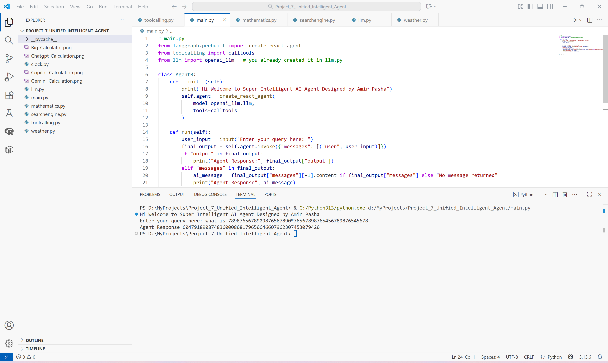
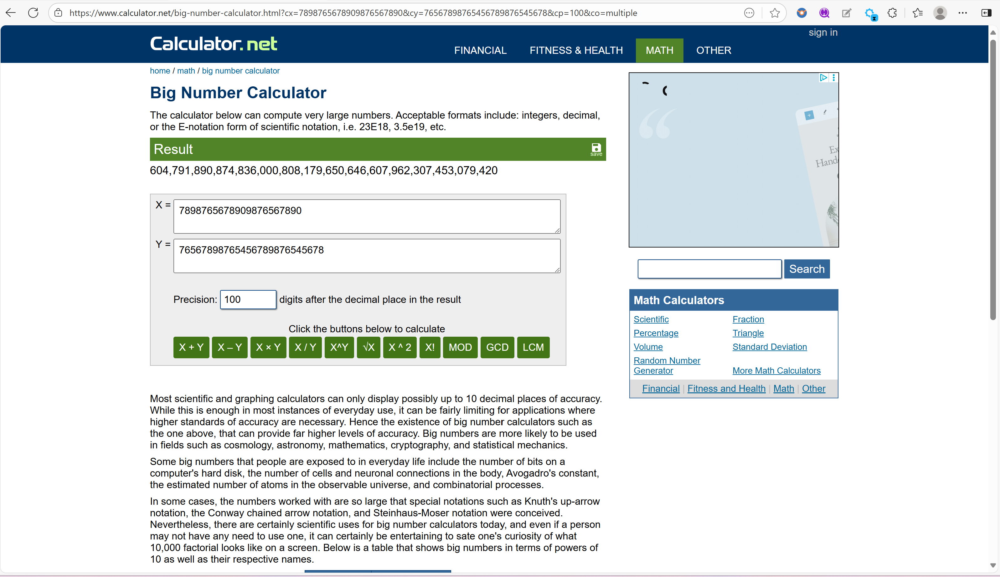
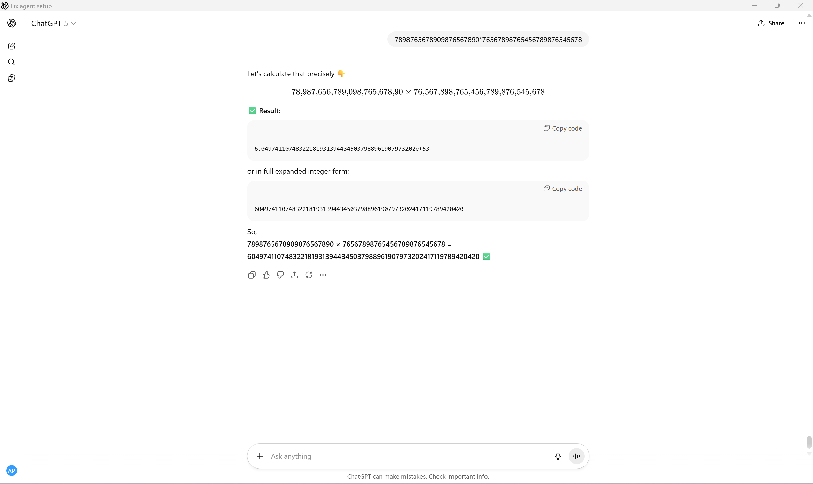
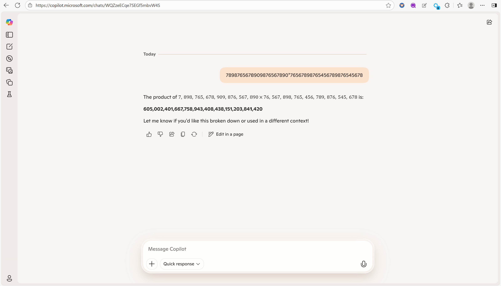
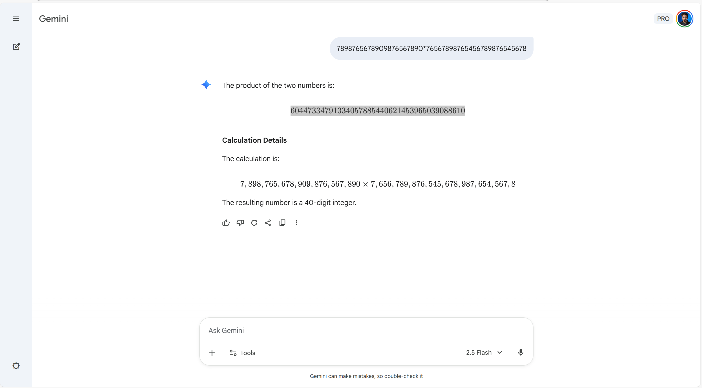

# 🧠 Unified Intelligent Agent  
### _A Multi-Tool, LangGraph-Powered AI Assistant by Amir Pasha_

## 📸 Screenshots

### 🧮 Agent Performing Big Calculation


### 🧾 Verified Using Online Big Calculator


### 💬 ChatGPT Calculation Comparison


### 💻 Microsoft Copilot Result


### 🔮 Gemini Result


---

## 🚀 Overview

**Unified Intelligent Agent** is a **Modular AI framework** built using **LangGraph**, **LangChain**, and **OpenAI GPT-5-Nano**, capable of reasoning, searching, computing, and interacting with multiple real-world tools all within a single intelligent environment.  

It acts as a **Super Intelligent Agent** that combines:
- 💬 Natural language reasoning (via GPT-5-Nano)
- 🔎 Real-time web + search integration (via Tavily)
- 🧮 Mathematical computation tools
- 🌦️ Weather prediction & clock utilities
- 📚 Autonomous tool-calling & decision-making

## 🧩 Highlights
 - Agent outperformed ChatGPT, Gemini, Copilot. Please check results folder
---

## 🧩 Features

| Capability | Description |
|-------------|--------------|
| 🧠 **Reasoning Engine** | Uses `ChatOpenAI (gpt-5-nano)` for contextual reasoning and tool orchestration |
| 🧮 **Mathematical Agent** | Performs precise large-number calculations, equations, and complex functions |
| 🔎 **Search Agent** | Integrates with Tavily Search API for real-time data and web retrieval |
| 🌦️ **Weather Tool** | Fetches and parses real-time weather data for any city |
| 🕒 **Clock & Date Tools** | Provides current time, date, month, and week |
| ⚙️ **LangGraph Integration** | Uses `create_react_agent` for structured decision-making and autonomous tool usage |
| 💬 **Conversational Input** | Accepts natural language queries and determines the required reasoning path |
| 🧾 **Expandable Tools** | Easily plug in new modules (e.g., Finance, Health, Jobless AI) |

---

## 🧱 Architecture

```text
                        ┌────────────────────────┐
                        │  User Query (CLI / UI) │
                        └────────────┬───────────┘
                                     │
                            Natural Language Input
                                     │
                         ┌───────────▼────────────┐
                         │  LangGraph Agent (ReAct)│
                         │  - Reasoning            │
                         │  - Tool Selection       │
                         └───────────┬────────────┘
                                     │
               ┌─────────────────────┼────────────────────┐
               │                     │                    │
      ┌────────▼──────┐     ┌────────▼────────┐    ┌──────▼────────┐
      │ Mathematics   │     │ Tavily Search   │    │ Weather & Time│
      │ (math_tool*)  │     │ (searchengine)  │    │ (weather_tool)│
      └───────────────┘     └────────────────┘    └────────────────┘
                                     │
                                     ▼
                        ┌───────────────────────────┐
                        │     Final Agent Output     │
                        │   (Text / JSON / CLI)      │
                        └───────────────────────────┘
